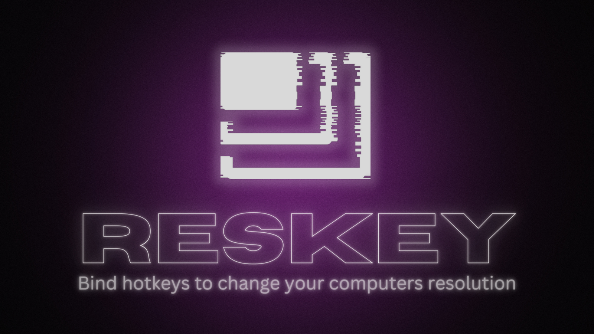

# ResKey: A hotkey manager for resolution changes

## Download

ResKey is currently still under development. Once we release the first alpha, you will be able to download it here.

## Features

- ✔️ Define as many hotkeys as you want
- ✔️ Choose from all resolutions your screen supports
- ✔️ Change your Resolution and Refresh rate, with the click of a key

## Development 

### Live coding

To run in live development mode, run wails dev in the project directory. This will run a Vite development server that will provide very fast hot reload of your frontend changes. If you want to develop in a browser and have access to your Go methods, there is also a dev server that runs on http://localhost:34115. Connect to this in your browser, and you can call your Go code from devtools.

### Building

To build a redistributable, production mode package, use wails build.

## Credits

- [ReaperMaga]('https://github.com/reapermaga')
- [Zoey]('https://github.com/zoey-kaiser')

## License

Distribbuted under the MIT License. See [LICENSE](LICENSE) for more information.
